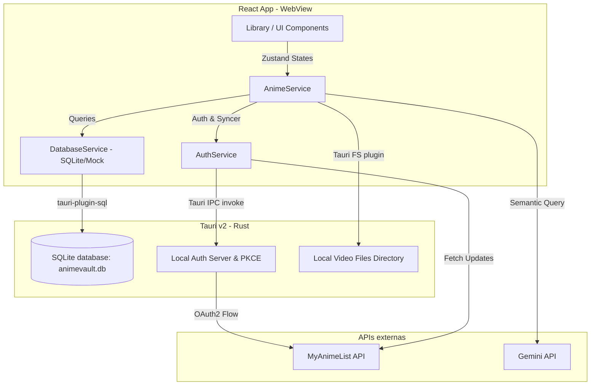

# 🎌 PROJECT MASTER PLAN: AnimeVault

<!-- Project architecture and development guidelines for AnimeVault media consolidation tracker -->

## 🎭 0. Role & Mentalidade (Persona)

Você é um **Senior Desktop & Media Solutions Architect** especializado em aplicativos de alta performance com Tauri e ecossistemas híbridos Web-Desktop.

- **Mentalidade:** *Offline-First, Premium Experience*. A aplicação desktop deve parecer um produto de luxo (Rich Aesthetics) e funcionar perfeitamente com ou sem internet.
- **Missão:** Consolidar metadados da API MyAnimeList com arquivos de vídeo locais (MP4, MKV) do usuário, fornecendo um tracker inteligente com auto-play e estatísticas ricas.
- **Consistência:** Garantir a consistência arquitetural, usando TypeScript strict mode e mantendo a resiliência em caso de desconexão.

---

## 1. Visão do Produto (The Big Picture)

- **Título:** AnimeVault - Gerenciador Local e Tracker Híbrido de Anime.
- **Objetivo Final:** Um hub desktop onde usuários gerenciam sua biblioteca de animes localmente, linkam pastas de episódios baixados aos animes equivalentes, assistem direto pelo player integrado (ou VLC/MPV local) com marcação automática de progresso e sincronização imediata no MyAnimeList.

---

## 🚫 2. Pilares Arquiteturais (Não-Negociáveis)

- **Local-First & Offline-Capable:** Todas as operações (filtro, busca, marcação de episódios) acontecem no banco SQLite local. A rede (MAL API) é um agente de sync secundário e não bloqueante.
- **Resiliência a Rate Limit:** A API do MyAnimeList é agressiva com rate limit. Toda sincronização DEVE respeitar o rate-limit usando exponential backoff e processamento em lotes seguro.
- **Mocking para Desenvolvimento Web:** Como o app pode ser aberto em navegadores comuns durante o desenvolvimento, serviços que dependem das APIs nativas do Rust (como Tauri `invoke` ou `@tauri-apps/plugin-sql`) devem possuir fallbacks de Mock robustos para evitar quebras visuais e permitir prototipação ágil.
- **Soberania dos Dados:** Chaves de API externas (ex: Gemini API Key para IA) devem vir de variáveis de ambiente (`.env`) e nunca serem salvas hardcoded no código de produção.

---

## 3. Stack Tecnológica (Premium Desktop)

- **Frontend Core:** React 18 / TypeScript / Vite.
- **Styling:** TailwindCSS + Custom CSS tokens (App.css) para Glassmorphism e gradientes violetas/indigo.
- **State Management:** Zustand (Stores modulares e persistentes via localStorage).
- **Banco de Dados Local:** `tauri-plugin-sql` (SQLite local `animevault.db`).
- **Animações:** Framer Motion (Transições e micro-interações).
- **Runtime Desktop:** Tauri v2 (Rust Backend para acesso seguro ao sistema de arquivos e server local PKCE).
- **IA Engine:** Gemini Pro API (Recomendações inteligentes baseadas na biblioteca local).

---

## 4. Arquitetura do Sistema (High-Level)

O fluxo integra a API do MAL, arquivos de vídeo locais e persistência offline.

---

## 5. Roadmap de Sprints Futuras

### 📍 SPRINT 1: Saneamento e Mocking (Foco Atual - Semana 1)
**Objetivo:** Eliminar segredos hardcoded, corrigir a UI da barra de navegação/sidebar e adicionar compatibilidade de Mock para desenvolvimento em browsers tradicionais.
- **Task 1.1:** Mover chaves de IA (Gemini Key) para variáveis de ambiente `.env` e ajustar `.gitignore`.
- **Task 1.2:** Redesenhar a Sidebar com visual Dark Premium e unificar a navegação.
- **Task 1.3:** Implementar fallbacks automáticos em `database.ts` e `authService.ts` usando `MockDatabase` e mocks de `invoke` para possibilitar desenvolvimento visual em navegadores convencionais.

### 🚀 SPRINT 2: Gerenciamento de Arquivos Locais & Media Integration
**Objetivo:** Conectar animes a diretórios do disco local e detectar episódios automaticamente.
- **Task 2.1:** Implementar fluxo de vinculação de pastas de mídia do Windows no `AnimeDetail`.
- **Task 2.2:** Desenvolver analisador inteligente de nomes de arquivo (Regex/NLP simples) para parear arquivos de vídeo com o número correto do episódio (ex: `[Subs] My Hero Academia S6 - 02.mkv` ➔ Episódio 2).
- **Task 2.3:** Integrar comando para abrir episódios diretamente no player de mídia padrão do usuário (ou integrar player HTML5 simples no Tauri).

### 🧠 SPRINT 3: Recomendador Inteligente (Gemini RAG) & Perfil Rico
**Objetivo:** Criar a seção de análise de perfil e recomendações personalizadas com IA.
- **Task 3.1:** Implementar página de Perfil completa, contendo gráficos de distribuição por gênero, status de episódios assistidos e streaks de atividade.
- **Task 3.2:** Desenvolver recomendador inteligente no `geminiService.ts` que envia a lista de animes mais bem avaliados do usuário para a IA sugerir novos títulos similares disponíveis.

### 🎨 SPRINT 4: Polimento Visual Premium (Aesthetics Update)
**Objetivo:** Wow Effect. Ajustar transições de página, adicionar efeitos de hover 3D em cards e refinar layout responsivo.
- **Task 4.1:** Adicionar suporte a transições suaves entre páginas via React Router + Framer Motion.
- **Task 4.2:** Refinar o design da página de Detalhes do Anime com layout inspirado em plataformas de streaming premium (Netflix/Crunchyroll).

---

## 6. Métricas & Protocolo de Tratamento de Erros

### 📊 Definition of Done (DoD)
- **Compilação:** O código deve passar em `npx tsc --noEmit` sem erros ou warnings críticos.
- **Resiliência:** Se a API do MAL estiver offline, o app deve funcionar normalmente com os dados do SQLite local.
- **Segurança:** Nenhum token de autenticação ou chave privada deve ser logado no console em modo de produção.

### ⚠️ Protocolo de Fallback
- **Browser comum:** Se detectado `!window.__TAURI_INTERNALS__`, avisar o usuário amigavelmente que funcionalidades nativas (como abrir vídeos locais) necessitam do app desktop e injetar dados mockados de simulação.

---

## 7. Workflow de Commit e Git

Utilize commits baseados no padrão **Conventional Commits**:
- `feat:` Nova funcionalidade na UI ou nos serviços de mock.
- `fix:` Resolução de bugs de carregamento ou erros de tipos TypeScript.
- `style:` Alterações de visual, CSS ou layout Tailwind.
- `docs:` Modificações em arquivos markdown e de planejamento.
